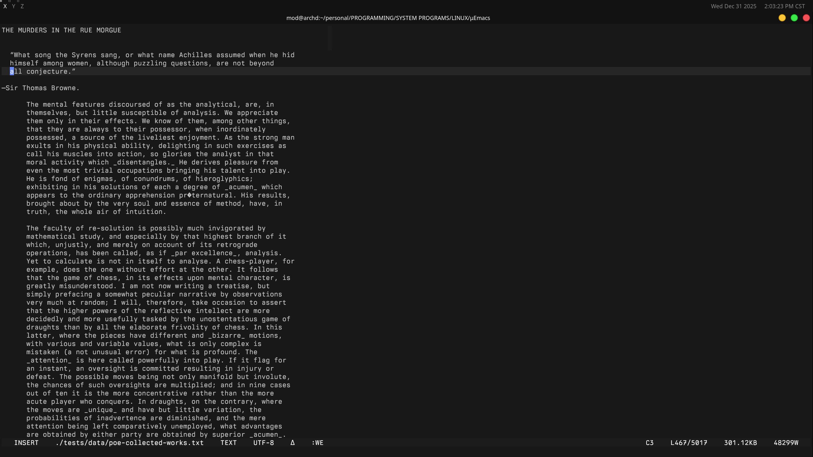
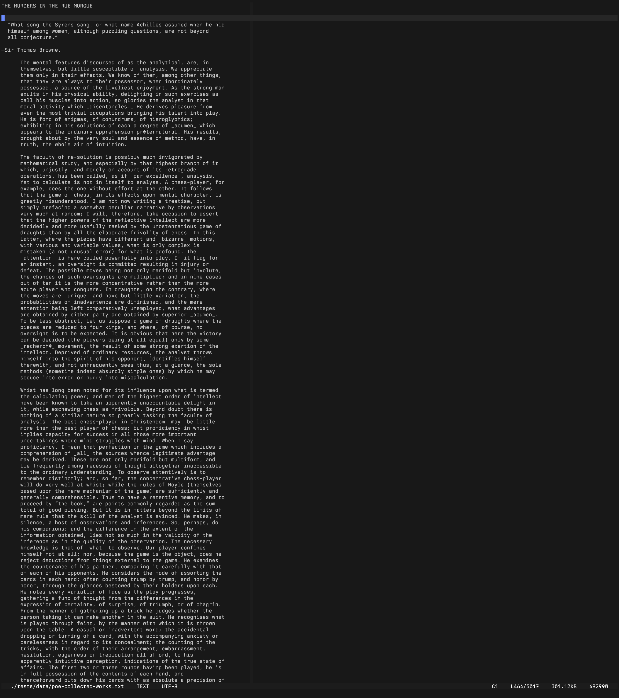

# μEmacs v0.0.23

A modern C23 text editor for Linux terminals, descended from Linus Torvalds' personal μEmacs. ~35,000 lines of C23 deliver O(1) keymap lookup, built-in terminal emulator, optional Vim emulation, "write-edit" mode and optimal rendering driven by a user's TOML.

---

**Key Features:**

### Keymap System (Complete Rewrite)
- **O(1) Hash-Based Lookup**: Replaced legacy O(n) linear keytab search with hash table
- **Hierarchical Prefix Keys**: Multi-level key sequences (C-x C-c, C-x 4 f, etc.) with recursive keymap nesting
- **Buffer-Local Bindings**: Per-buffer key overrides with automatic fallback to global map
- **Runtime Rebinding**: `M-x bind-to-key` for live customization without restart
- **Modifier Encoding**: Clean 32-bit key representation (Ctrl, Meta, Shift, C-x prefix flags)

### Terminal Emulator
- **Built-in Shell**: `C-x t` spawns terminal in split window - edit code while running builds
- **Full VT100/xterm Emulation**: CSI sequences, cursor addressing, scroll regions
- **PTY Management**: Proper pseudo-terminal allocation with signal handling
- **Seamless Integration**: `C-x o` switches focus, terminal output doesn't corrupt editor state

### VT500 Input State Machine
- **Modern Escape Parsing**: CSI, SS3, DCS sequence handling with timeout-based disambiguation
- **UTF-8 Input**: Full Unicode support with combining character awareness
- **Bracketed Paste**: Automatic detection of `\e[200~...\e[201~` paste boundaries
- **Kitty Protocol Groundwork**: Foundation for extended keyboard protocol support

### Display System
- **DEC 2026 Synchronized Updates**: `\e[?2026h` batching eliminates flicker on modern terminals
- **Cursor Line Highlight**: Configurable styles (underline, background, intensity)
- **Atomic Cursor Tracking**: Lock-free `_Atomic` cursor position for thread-safe updates
- **Palette System**: Theme-aware 256-color and truecolor with terminal palette integration
- **Legacy Optimization Removed**: Deleted buggy 1980s scroll optimization (~150 lines of complexity)

### Vim/Evil Mode (~2,100 lines)
- **Full Modal Editing**: Normal, Insert, Visual, Visual-Line, Replace modes
- **Motion Commands**: h/j/k/l, w/b/e/W/B/E, 0/$, ^/g_, gg/G, f/F/t/T, %
- **Operators**: d (delete), c (change), y (yank) - composable with motions
- **Text Objects**: iw/aw (word), i"/a" (quotes), i'/a', i(/a), i{/a}, i[/a]
- **Line Operations**: dd, yy, cc, D, C, Y with count prefixes
- **Registers & Marks**: Named registers (a-z), mark setting/jumping, `` and ''
- **Repeat & Undo**: `.` repeats last change, u/C-r for undo/redo
- **Visual Mode**: Character and line selection with operator application

### Search & Replace
- **Boyer-Moore-Horspool**: Sublinear O(n/m) average case with bad-character skip table
- **Thompson NFA Regex**: Zero-heap regex engine with `.`, `[class]`, `^$`, `*`, `+`, `?`
- **Parallel Search**: Multi-threaded for buffers exceeding configurable threshold
- **Incremental Search**: Real-time highlighting as you type (C-s / C-r)

### Undo/Redo System
- **VSCode-Style Grouping**: Intelligent operation coalescing within 400ms windows
- **Atomic Circular Buffer**: Lock-free with 10,000 operation capacity
- **Word Boundary Detection**: Groups character insertions by word boundaries
- **Version Tracking**: 64-bit timestamps for precise undo tree navigation

### Text Infrastructure
- **Gap Buffer**: O(1) insert/delete at cursor with dynamic resizing
- **UTF-8 Native**: Proper character counting, cursor movement, display width
- **Kill Ring**: 32-entry circular buffer (8KB per entry) with clipboard sync
- **System Clipboard**: Automatic xclip/xsel integration for copy/paste

### Configuration
- **TOML Format**: Clean, readable config replacing legacy JSON
- **Embedded Parser**: Zero external dependencies for config parsing
- **XDG Compliant**: `~/.config/muemacs/settings.toml` with proper fallback chain
- **Runtime Settings**: `M-x set-variable` for live configuration changes

### C23 Architecture
- **Modern C23**: `nullptr`, `_Atomic`, `static_assert`, `alignas`
- **Memory Safety**: Centralized allocation with leak tracking and overflow protection
- **Thread Safety**: Atomic operations throughout (cursor, display, undo, kill ring)
- **Zero Legacy**: All MSDOS, VMS, Amiga, termcap code removed - Linux only

### Main Interface: evil-mode, write-edit Enabled


### Large Display View: Default muEmacs


## Build

### Quick Install

```bash
cmake -B build && cmake --build build -j$(nproc)
sudo cmake --install build
```

**Run**: `μEmacs [FILE]` or `muEmacs [FILE]` (ASCII alias)

### Dependencies

- **Compiler**: GCC 12+ or Clang 15+ with C23 support
- **Libraries**: ncursesw
- **Optional**: xclip or xsel for system clipboard

**Arch Linux:**
```bash
sudo pacman -S gcc cmake ncurses
```

**Debian/Ubuntu:**
```bash
sudo apt install gcc cmake libncursesw5-dev
```

## Configuration

μEmacs reads from `~/.config/muemacs/settings.toml` (XDG compliant):

```toml
[editor]
column_width = 80
wrap = false
evil_mode = false           # Enable vim emulation
tab_width = 8

[visual]
ruler = true
ruler_col = 80
highlight_line = true

[terminal]
enabled = true              # Allow C-x t terminal
height_percent = 45

[performance]
parallel_threshold = 1000   # Min lines for parallel search
max_threads = 8
```

**Locations:**
- User config: `~/.config/muemacs/settings.toml`
- System defaults: `/usr/share/muemacs/editor/settings.toml`

## Keybindings

### Essential
| Key | Action |
|-----|--------|
| `C-x C-c` | Quit |
| `C-x C-s` | Save |
| `C-x C-f` | Open file |
| `C-g` | Abort |
| `M-x` | Execute command |

### Navigation
| Key | Action |
|-----|--------|
| `C-a` / `C-e` | Beginning/end of line |
| `C-f` / `C-b` | Forward/backward char |
| `C-n` / `C-p` | Next/previous line |
| `C-v` / `M-v` | Page down/up |
| `M-<` / `M->` | Beginning/end of buffer |
| `M-g` | Go to line |

### Editing
| Key | Action |
|-----|--------|
| `C-d` | Delete forward |
| `C-k` | Kill to end of line |
| `C-w` | Kill region (cut) |
| `M-w` | Copy region |
| `C-y` | Yank (paste) |
| `C-_` | Undo |
| `M-_` | Redo |

### Windows & Buffers
| Key | Action |
|-----|--------|
| `C-x 2` | Split window |
| `C-x o` | Next window |
| `C-x 0` | Close window |
| `C-x b` | Switch buffer |
| `C-x t` | Open terminal |

### Search
| Key | Action |
|-----|--------|
| `C-s` | Incremental search forward |
| `C-r` | Incremental search backward |
| `M-r` | Replace |
| `M-C-r` | Query replace |

**Meta Key**: Use `ESC` or `Alt` as Meta prefix.

## Vim Mode

Enable with `evil_mode = true` in settings.toml.

### Modes
- **Normal**: Navigation and commands (default)
- **Insert**: Text entry (`i`, `a`, `o`, `A`, `O`)
- **Visual**: Selection (`v`, `V`)
- **Replace**: Overwrite (`R`)

### Commands
```
h/j/k/l     Movement
w/b/e       Word motion
0/$         Line start/end
gg/G        Buffer start/end
dd/yy/cc    Line operations
dw/yw/cw    Word operations
diw/daw     Text objects
p/P         Paste after/before
u / C-r     Undo/redo
.           Repeat last command
```

## Terminal Emulator

Press `C-x t` to open a shell in a split window:

- Full VT100/xterm emulation
- Run builds, git, tests while editing
- `C-x o` switches between editor and terminal
- `C-x 0` closes terminal window

## Testing

```bash
# Run integration tests
./build/bin/full_integration_test

# Python TUI tests (requires pexpect, pyte)
cd tests/tui && python -m pytest
```

## Technical Highlights

- **35,000 lines** of C23 (src/ + include/)
- **O(1) keymap** with hash-based lookup
- **Zero legacy code** - all MSDOS/VMS/termcap removed
- **Atomic operations** throughout (cursor, display, undo)
- **DEC 2026 sync** for flicker-free rendering
- **Gap buffer** with dynamic resizing
- **Thompson NFA** regex with zero-heap runtime

## History

μEmacs traces from MicroEMACS (1985) through Petri Kutvonen's uEmacs/PK to Linus Torvalds' personal fork. This project modernizes for 2025 while preserving the small, fast, keyboard-driven editor philosophy.

## Credits

- Original μEmacs: Linus Torvalds
- C23 Modernization: Will Clingan
- v0.0.23: Terminal emulator, Vim mode, modern keymap system

## License

Original μEmacs license terms apply.
