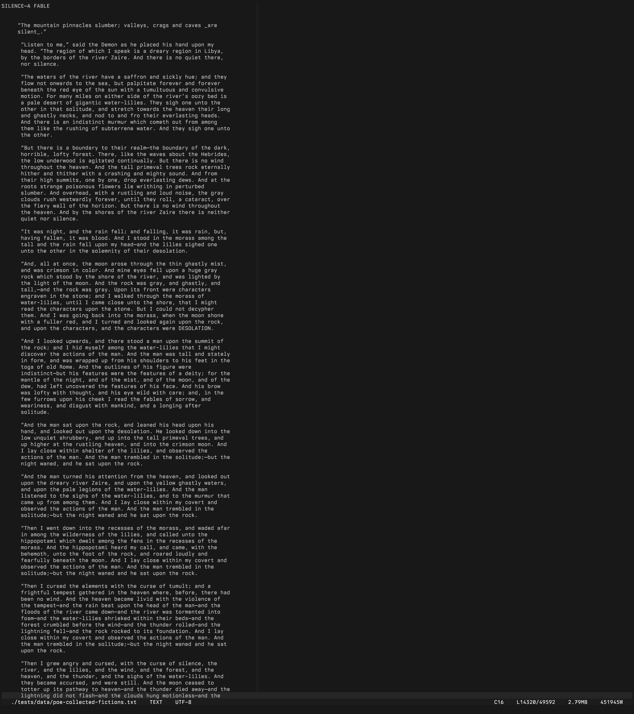

# μEmacs

A modern, extensible C23 text editor for Linux terminals, descended from Linus Torvalds' personal uemacs project.

*ATTENTION: As of January 2026, Linus Torvalds has been modernizing and updating his uemacs project. With this in mind, μEmacs will continue development but in different aspects while respecting the origins of the project. The core of the edtior will remain, but several modern pieces will be moved to the Extension level, ie Evil Mode and others. If you would like to use Linus' setup in μEmacs, please see the "linus-mode" in muEmacs-extensions.*

---

**Key Features:**

### Keymap System
- **O(1) Hash-Based Lookup**: Replaced legacy O(n) linear keytab search with hash table
- **Hierarchical Prefix Keys**: Multi-level key sequences (C-x C-c, C-x 4 f, etc.) with recursive keymap nesting
- **Buffer-Local Bindings**: Per-buffer key overrides with automatic fallback to global map
- **Runtime Rebinding**: `M-x bind-to-key` for live customization without restart
- **Modifier Encoding**: Clean 32-bit key representation (Ctrl, Meta, Shift, C-x prefix flags)

### Terminal Emulator
- **Built-in Shell**: `C-x t` spawns terminal in split window - edit code while running builds
- **Full VT100/xterm Emulation**: CSI sequences, cursor addressing, scroll regions
- **PTY Management**: Proper pseudo-terminal allocation with signal handling
- **Seamless Integration**: `C-x o` switches focus, terminal output doesn't corrupt editor state
- **Build Integration**: `build-run`, `build-next-error`, `build-prev-error` for compile-edit cycles
- **REPL Integration**: `repl-start`, `repl-eval-line`, `repl-eval-region`, `repl-eval-buffer`

### VT500 Input State Machine
- **Modern Escape Parsing**: CSI, SS3, DCS sequence handling with timeout-based disambiguation
- **UTF-8 Input**: Full Unicode support with combining character awareness
- **Bracketed Paste**: Automatic detection of `\e[200~...\e[201~` paste boundaries
- **Kitty Protocol Groundwork**: Foundation for extended keyboard protocol support

### Display System
- **Synchronized Updates**: Batching eliminates flicker on modern terminals
- **Pretext-Inspired Wrap Cache**: Two-phase architecture separates text analysis from layout. Per-line segment cache computed once on edit, layout via pure arithmetic on resize. Pending-break pattern (no backtracking). No 4KB buffer limit.
- **Cursor Line Highlight**: Configurable styles (underline, background, intensity)
- **Atomic Cursor Tracking**: Lock-free `_Atomic` cursor position for thread-safe updates
- **Palette System**: Theme-aware 256-color and truecolor with terminal palette integration

### Vim/Evil Mode (c_evil extension)
- **Full Modal Editing**: Normal, Insert, Visual, Visual-Line, Visual-Block, Replace modes
- **Motion Commands**: h/j/k/l, w/b/e/W/B/E, 0/$, ^/g_, gg/G, f/F/t/T, %
- **Operators**: d (delete), c (change), y (yank) - composable with motions
- **Text Objects**: iw/aw (word), i"/a" (quotes), i'/a', i(/a), i{/a}, i[/a]
- **Line Operations**: dd, yy, cc, D, C, Y with count prefixes
- **Registers & Marks**: Named registers (a-z), mark setting/jumping, `` and ''
- **Repeat & Undo**: `.` repeats last change, u/C-r for undo/redo
- **Visual Mode**: Character and line selection with operator application
- **Extension-based**: Loaded via UEP like any other extension, not compiled into core

### Search & Replace
- **Boyer-Moore-Horspool**: Sublinear O(n/m) average case with bad-character skip table
- **Thompson NFA Regex**: Zero-heap regex engine with `.`, `[class]`, `^$`, `*`, `+`, `?`
- **Parallel Search**: Multi-threaded for buffers exceeding configurable threshold
- **Incremental Search**: Real-time highlighting as you type (C-s / C-r)

### Undo/Redo System
- **VSCode-Style Grouping**: Intelligent operation coalescing within 400ms windows
- **Atomic Circular Buffer**: Lock-free with 10,000 operation capacity
- **Word Boundary Detection**: Groups character insertions by word boundaries
- **Version Tracking**: 64-bit timestamps for precise undo tree navigation

### Text Infrastructure
- **Dual Storage Backends**: Vtable-based abstraction with heuristic selection
  - **Gap Buffer**: O(1) insert/delete at cursor, optimal for small files with high edit locality
  - **Piece Table**: O(1) load via mmap, optimal for large files (>2MB) with sparse edits
- **Automatic Selection**: Files <2MB use gap buffer, >=2MB use piece table with mmap. Edit density >20% triggers conversion back to gap buffer.
- **UTF-8 Native**: Proper character counting, cursor movement, display width
- **Kill Ring**: 32-entry circular buffer (8KB per entry) with clipboard sync
- **System Clipboard**: Automatic xclip/xsel integration for copy/paste

### Extension System (UEP)

The μEmacs Extension Protocol is a **polyglot extension system supporting 11 programming languages** with hybrid process isolation. Write extensions in whatever language fits the task - from C for tight editor integration to Haskell for complex project analysis.

**Three-Layer Architecture:**

| Layer | Type | Location | Use Case |
|-------|------|----------|----------|
| 1 | Core API | Internal | Editor primitives exposed to Layers 2-3 |
| 2 | Lua Scripts | `~/.config/muemacs/scripts/` | Lightweight automation, hot-reloadable |
| 3 | Native Extensions | `~/.config/muemacs/extensions/` | Full-featured plugins via shared objects |

**Hybrid Process Isolation:**

Extensions run either in-process or out-of-process depending on their runtime:

| Mode | Languages | Mechanism | Trade-off |
|------|-----------|-----------|-----------|
| **In-Process** | C, Rust, Zig | Direct `dlopen()` | Lowest latency, shared memory |
| **Out-of-Process** | Go, Ada, Haskell, Crystal, Pascal | IPC bridge | Crash isolation, GC freedom |

Out-of-process extensions communicate via modern Linux primitives:
- **memfd**: Anonymous shared memory for zero-copy data transfer
- **eventfd**: Low-latency signaling between editor and extension
- **pidfd**: Race-free process lifecycle management
- **seccomp-bpf**: Syscall whitelist per runtime (C: ~30, Go: ~50, Haskell: ~55)
- **landlock**: Filesystem restriction (extension dir read, /tmp read/write, deny ~/.ssh)

Extensions load in parallel at startup with thread-safe command registration.

Write extensions in C for performance, Rust for safety, Go for concurrency, or Haskell for elegance - whatever fits your problem.

**Bundled Extensions:**

| Extension | Lang | Description |
|-----------|------|-------------|
| `c_git` | C | Git integration - status, stage, commit, diff, log, blame |
| `c_lint` | C | Unified diagnostics aggregating pattern rules, tree-sitter, and LSP |
| `c_mouse` | C | Full mouse support - click, double/triple-click, drag select, scroll |
| `c_write_edit` | C | Prose editing - soft wrap, smart quotes, em-dashes |
| `rust_search` | Rust | Ripgrep-powered project search with result navigation |
| `zig_treesitter` | Zig | Tree-sitter syntax highlighting for C, Python, Rust, JS, Bash |
| `go_lsp` | Go | Language Server Protocol - completion, go-to-def, hover, diagnostics |
| `ada_fuzzy` | Ada | Fuzzy file finder with ranked matching |
| `pascal_multicursor` | Pascal | Multiple cursor editing |
| `haskell_project` | Haskell | Project detection and file navigation |
| `crystal_ai` | Crystal | AI code assistance via Claude CLI agents |

**Event Bus:**

Extensions communicate through a publish-subscribe event system:
```
buffer:load, buffer:save, buffer:close
input:key, input:mouse
lsp:diagnostics, treesitter:parsed
```

**Extension API (v4 - ABI-Stable Named Lookup):**
```c
// Extensions use api->get_function("name") for forward-compatible lookups
fn_t my_fn = api->get_function("register_command");

// Direct struct members also available for backward compatibility
api->register_command("my-cmd", my_handler);
api->on("buffer:save", on_save, nullptr, 0);
api->message("Hello from extension!");
// ... 40+ functions
```

**Naming Convention:** `language_tool/` directories containing `language_tool.so`

**Commands:** `extension-load`, `extension-unload`, `extension-list`, `scripts-reload`

### Encryption
Shell out to battle-tested system tools:
- **GPG**: `encrypt-buffer`, `decrypt-file` (AES256 symmetric)
- **age**: `encrypt-buffer-age`, `decrypt-file-age`
- **Auto-detect**: `encrypt-buffer-auto` finds best available tool
- **show-encryption-tools**: Display available encryption tools

### Clipboard
Multiple providers with automatic detection:
- **OSC 52**: Terminal escape sequence - works over SSH/tmux (kitty, alacritty, foot, iTerm2)
- **Wayland**: wl-copy/wl-paste native support
- **X11**: xclip, xsel integration
- **Commands**: `copy-to-clipboard`, `yank-clipboard`, `clipboard-provider`

### Configuration
- **TOML Format**: Clean, readable config replacing legacy JSON
- **Embedded Parser**: Zero external dependencies for config parsing
- **XDG Compliant**: `~/.config/muemacs/settings.toml` with proper fallback chain
- **Runtime Settings**: `M-x set-variable` for live configuration changes
- **Commands**: `open-user-config`, `list-settings`, `save-settings`

### C23 Architecture
- **Modern C23**: `nullptr`, `_Atomic`, `static_assert`, `alignas`
- **Memory Safety**: Centralized allocation with leak tracking and overflow protection
- **Thread Safety**: Atomic operations throughout (cursor, display, undo, kill ring)
- **Zero Legacy**: All MSDOS, VMS, Amiga, termcap code removed - Linux only

### Kernel Integration
- **Event Loop**: Backend-agnostic abstraction with three-tier fallback (io_uring > epoll > poll)
- **io_uring**: Raw syscalls (no liburing), multi-shot poll, batch file I/O, adaptive timeout
- **timerfd**: Precision timers for auto-save, cursor blink, resize debounce, extension timeout
- **signalfd**: Signal-to-fd conversion for SIGWINCH/SIGINT/SIGTERM/SIGHUP (crash handlers remain SA_RESETHAND)
- **pidfd**: Race-free extension process monitoring
- **seccomp-bpf**: Per-runtime syscall whitelist for extension sandboxing
- **landlock**: Filesystem restriction for extension processes
- **madvise**: MADV_SEQUENTIAL/MADV_RANDOM/MADV_WILLNEED for piece table mmap access patterns

### Main Interface: evil-mode Enabled


### Large Display View: Default muEmacs


## Installation

### Simple Install

```bash
./install.py
```

**Run**: `μEmacs [FILE]` or `muEmacs [FILE]` (ASCII alias)

### Advanced Install (CMake)

```bash
# Configure
cmake -B build -DCMAKE_BUILD_TYPE=Release

# Build
cmake --build build -j$(nproc)

# Install (optional)
sudo cmake --install build
```

### Other Commands

```bash
./install.py build       # Build only, don't install
./install.py clean       # Clean build directory
./install.py uninstall   # Remove installed binaries
./install.py test        # Run tests
./install.py --debug     # Debug build (ASAN/UBSAN, no logging)
./install.py --debug-log # Debug build with logging to /tmp/muemacs_debug.log
```

### Dependencies

- **Compiler**: GCC 13+ or Clang 16+ with C23 support
- **Build**: CMake 3.20+
- **Libraries**: None (pure ANSI terminal driver, no ncurses)
- **Optional**: xclip or xsel for system clipboard, gpg or age for encryption

**Arch Linux:**
```bash
sudo pacman -S gcc cmake
```

**Debian/Ubuntu:**
```bash
sudo apt install gcc cmake
```

## Configuration

μEmacs reads from `~/.config/muemacs/settings.toml` (XDG compliant):

```toml
[editor]
column_width = 80
wrap = false
evil_mode = false           # Enable vim emulation (requires c_evil extension)
tab_width = 8

[visual]
ruler = true
ruler_col = 80
highlight_line = true

[terminal]
enabled = true              # Allow C-x t terminal
height_percent = 45

[clipboard]
provider = "auto"           # auto, osc52, xclip, xsel, wl-copy
osc52_enabled = true        # Works over SSH/tmux

[wrap]
soft_wrap = false
soft_wrap_column = 80

[extensions.python]
format = "black -q -"

[extensions.rust]
format = "rustfmt"

[extensions.c]
format = "clang-format"

[performance]
parallel_threshold = 1000   # Min lines for parallel search
max_threads = 8

# Native UEP extensions (in ~/.config/muemacs/extensions/)
[extension.c_mouse]
enabled = true
scroll_lines = 3

[extension.c_git]
auto_status = true
```

**Locations:**
- User config: `~/.config/muemacs/settings.toml`
- System defaults: `/usr/share/muemacs/editor/settings.toml`

## Keybindings

### Essential
| Key | Action |
|-----|--------|
| `C-x C-c` | Quit |
| `C-x C-s` | Save |
| `C-x C-f` | Open file |
| `C-g` | Abort |
| `M-x` | Execute command |

### Navigation
| Key | Action |
|-----|--------|
| `C-a` / `C-e` | Beginning/end of line |
| `C-f` / `C-b` | Forward/backward char |
| `C-n` / `C-p` | Next/previous line |
| `C-v` / `M-v` | Page down/up |
| `M-<` / `M->` | Beginning/end of buffer |
| `M-g` | Go to line |

### Editing
| Key | Action |
|-----|--------|
| `C-d` | Delete forward |
| `C-k` | Kill to end of line |
| `C-w` | Kill region (cut) |
| `M-w` | Copy region |
| `C-y` | Yank (paste) |
| `C-_` | Undo |
| `M-_` | Redo |

### Windows & Buffers
| Key | Action |
|-----|--------|
| `C-x 2` | Split window |
| `C-x o` | Next window |
| `C-x 0` | Close window |
| `C-x b` | Switch buffer |
| `C-x t` | Open terminal |

### Search
| Key | Action |
|-----|--------|
| `C-s` | Incremental search forward |
| `C-r` | Incremental search backward |
| `M-r` | Replace |
| `M-C-r` | Query replace |

**Meta Key**: Use `ESC` or `Alt` as Meta prefix.

## Vim Mode (c_evil Extension)

Vim modal editing is provided by the `c_evil` extension in `muEmacs-extensions`.
Enable with `evil_mode = true` in settings.toml or `M-x evil-mode`.

### Modes
- **Normal**: Navigation and commands (default when enabled)
- **Insert**: Text entry (`i`, `a`, `o`, `A`, `O`)
- **Visual**: Selection (`v`, `V`, `C-v`)
- **Replace**: Overwrite (`R`)

### Commands
```
h/j/k/l     Movement
w/b/e       Word motion
0/$         Line start/end
gg/G        Buffer start/end
dd/yy/cc    Line operations
dw/yw/cw    Word operations
diw/daw     Text objects
p/P         Paste after/before
u / C-r     Undo/redo
.           Repeat last command
```

## Terminal Emulator

Press `C-x t` to open a shell in a split window:

- Full VT100/xterm emulation
- Run builds, git, tests while editing
- `C-x o` switches between editor and terminal
- `C-x 0` closes terminal window
- `build-run` runs make/build command
- `build-next-error` / `build-prev-error` jump to errors

## Shell Integration

μEmacs exports environment variables to spawned processes:

| Variable | Content |
|----------|---------|
| `$UE_FILENAME` | Current file path |
| `$UE_BUFNAME` | Current buffer name |
| `$UE_LINE` | Cursor line (1-indexed) |
| `$UE_COL` | Cursor column (0-indexed) |
| `$UE_FILETYPE` | Detected type (c, python, rust...) |
| `$UE_MODIFIED` | "1" if buffer modified |
| `$UE_TERMINAL` | "1" when inside μEmacs terminal |

Use in shell scripts for editor-aware tooling.

## Performance

| Metric | Result | Notes |
|--------|--------|-------|
| **Startup** | **435 us** | 100-run average. ~35x faster than Vim (~15ms) |
| **49,592-line file load** | **1 ms** | Poe collected works. mmap piece table path |
| **Full clean rebuild** | **2.3 s** | 90 .c files, 6 targets, all tests. `-j$(nproc)` |
| **Binary size** | **1.7 MB** | Debug build, unstripped |
| **Test suite** | **88/88 pass** | 12 suites, fork-isolated, ASAN/UBSAN compatible |

### Test Results

| Suite | Tests | Status |
|-------|-------|--------|
| Keymap & Input | 6 | PASS |
| Core Text & Buffer | 15 | PASS |
| Navigation & Editing | 7 | PASS |
| Text Processing | 9 | PASS |
| Configuration | 6 | PASS |
| I/O & File Operations | 4 | PASS |
| Terminal & Display | 8 | PASS |
| Vim Mode (Evil) | 2 | PASS |
| Utilities & Platform | 7 | PASS |
| Atomic Stats & Concurrency | 4 | PASS |
| Commands & Integration | 3 | PASS |
| Security | 5 | PASS |

## Testing

```bash
# Run integration tests
./build/bin/full_integration_test

# Python TUI tests (requires pexpect, pyte)
cd tests/tui && python -m pytest
```

## Architecture

```
~50,000 lines C23
├── src/core/       # Buffer, window, display, undo, keymap, piece table, gap buffer
├── src/terminal/   # PTY, VT100 emulation, input state machine
├── src/text/       # Search, NFA regex, word operations
├── src/config/     # TOML parser, settings, vim core infrastructure
├── src/io/         # File I/O, encryption, io_uring batch read
├── src/platform/   # Event loop (io_uring/epoll/poll), timers, sandbox, clipboard, spawn
├── src/syntax/     # Lexer, syntax highlighting
├── src/uep/        # Extension system, polyglot bridge, ext runner
└── src/util/       # UTF-8, memory, logging
```

## Technical Highlights

- **50,000 lines** of C23 (src/ + include/), 180K lines of tests
- **Sub-millisecond startup** (435us average, ~35x faster than Vim)
- **O(1) keymap** with hash-based lookup
- **Zero legacy code** - all MSDOS/VMS/termcap removed
- **Zero external dependencies** - pure ANSI terminal driver, no ncurses
- **Dual text storage**: Gap buffer + piece table with mmap, heuristic selection
- **Boyer-Moore-Horspool** search on both storage backends
- **Pretext-inspired wrap cache**: Segment-based line layout with pending-break pattern
- **Event loop**: Three-tier backend (io_uring > epoll > poll) with timerfd and signalfd
- **Extension sandboxing**: seccomp-bpf syscall filtering + landlock filesystem restriction
- **Thread-safe** extension loading with mutex-protected command registry
- **Atomic operations** throughout (cursor, display, undo)
- **Polyglot extensions** - 11 languages via hybrid in-process/IPC architecture
- **Thompson NFA** regex with zero-heap runtime
- **io_uring batch file I/O**: Single-syscall file loading via IORING_OP_READ
- **88 tests** across 12 suites with fork isolation and signal-based crash detection

## History

```
MicroEMACS (1985)
    ↓
uEmacs/PK (Petri Kutvonen)
    ↓
μEmacs (Linus Torvalds' personal fork)
    ↓
μEmacs v3.0.0 (C23 modernization)
```

μEmacs traces from MicroEMACS (1985) through Petri Kutvonen's uEmacs/PK to Linus Torvalds' personal fork. This project modernizes for 2026 while preserving the small, fast, keyboard-driven editor philosophy.

## Credits

- **Original μEmacs**: Linus Torvalds
- **MicroEMACS**: Dave G. Conroy, Daniel M. Lawrence
- **uEmacs/PK**: Petri H. Kutvonen
- **C23 Modernization**: Will Clingan
- v1.0: Terminal emulator, Vim mode, polyglot extensions, CI/CD, modern keymap system
- v2.1.0: Linus baseline defaults, Vim extracted to c_evil extension, piece table
  with mmap, text storage abstraction, event bus, kernel integration (io_uring,
  epoll, timerfd, signalfd, pidfd, seccomp-bpf, landlock), codebase audit
- v3.0.0: Pretext-inspired wrap segment cache (two-phase prepare/layout, pending-break
  pattern, no 4KB limit), Boyer-Moore on both storage backends, piece table memory
  safety cleanup, parallel search thread hardening, compilation warning sweep

## License

Original μEmacs license terms apply.
